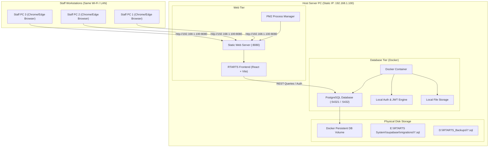

# RTARTS System — Local Production Deployment & Operations Guide

> **Document Type:** Production Operations, Architecture, Data Migration & Disaster Recovery Manual  
> **Environment:** On-Premise / Local Area Network (LAN) — No External Internet Required  
> **System Name:** Registrar & Transfer Agent / Registry Transfer System (RTARTS)

---

## Table of Contents
1. [Architecture & System Overview](#1-architecture--system-overview)
2. [Prerequisites & Software Requirements](#2-prerequisites--software-requirements)
3. [Server Host Setup & Static IP Configuration](#3-server-host-setup--static-ip-configuration)
4. [Environment Configuration & Production Build](#4-environment-configuration--production-build)
5. [Process Management & Windows Auto-Boot (PM2)](#5-process-management--windows-auto-boot-pm2)
6. [Windows Firewall Rules](#6-windows-firewall-rules)
7. [Client Workstation Access Guide](#7-client-workstation-access-guide)
8. [Data Storage & SQL File Locations](#8-data-storage--sql-file-locations)
9. [Automated Daily Database Backups & Disaster Recovery](#9-automated-daily-database-backups--disaster-recovery)
10. [Excel Historical Data Migration Checklist](#10-excel-historical-data-migration-checklist)

---

## 1. Architecture & System Overview

The RTARTS platform is engineered as an on-premise, containerized financial registry application designed to run entirely inside your private local network.



---

## 2. Prerequisites & Software Requirements

### A. Host Server PC (Only 1 Computer)
- **Operating System:** Windows 10/11 Pro (or Windows Server / Linux)
- **Processor:** Quad-Core CPU (Intel Core i5 / Ryzen 5 or higher)
- **Memory (RAM):** 8 GB minimum (16 GB recommended for 500,000+ records)
- **Storage:** Solid State Drive (SSD / NVMe) with at least 50 GB free space
- **Network:** Connected to local office router via Ethernet cable (recommended) or Wi-Fi

#### Required Free Software on Host PC:
1. **Docker Desktop** (Free): Runs PostgreSQL, Auth, and Storage.
2. **Node.js (v20 or v22 LTS)** (Free): Compiles and serves the web application.
3. **PM2 & Serve** (Free): Installed via Node.js terminal (`npm install -g pm2 serve`).

### B. Staff Client PCs (Workstations)
- **Zero Software Required.**
- No Docker, no Node.js, no database software.
- Any standard web browser (Google Chrome, Microsoft Edge, Mozilla Firefox, Brave).

---

## 3. Server Host Setup & Static IP Configuration

Assign a permanent static IP to the host PC so client workstations always connect to the same address.

### Step 1: Assign Static IP in Windows
1. Press `Win + R`, type `ncpa.cpl` and hit **Enter**.
2. Right-click your Ethernet / Wi-Fi adapter $\rightarrow$ **Properties**.
3. Select **Internet Protocol Version 4 (TCP/IPv4)** $\rightarrow$ **Properties**.
4. Set fixed IP details (adjust according to your router subnet):
   - **IP Address:** `192.168.1.100` (or `192.168.0.100`)
   - **Subnet Mask:** `255.255.255.0`
   - **Default Gateway:** `192.168.1.1` (Router IP)
   - **DNS:** `1.1.1.1` / `8.8.8.8`
5. Click **OK**.

---

## 4. Environment Configuration & Production Build

### Step 1: Update `.env.production` with Host IP
In your project folder (`E:\RTARTS System\.env.production` or `.env`):

```env
# Point to the Server PC's static IP (replace 192.168.1.100 with your server's IP)
VITE_SUPABASE_URL=http://192.168.1.100:54321
VITE_SUPABASE_ANON_KEY=eyJhbGciOiJIUzI1NiIsInR5cCI6IkpXVCJ9...
```

### Step 2: Build the Production Bundle
Open PowerShell in `E:\RTARTS System` and run:
```powershell
npm run build
```
*This compiles and minifies all React code, charts, PDF engines, and Excel handlers into the optimized `dist/` directory.*

---

## 5. Process Management & Windows Auto-Boot (PM2)

PM2 keeps the web server running 24/7 in the background and restarts it automatically if the computer reboots.

### Step 1: Install PM2 and Serve Globally
```powershell
npm install -g pm2 serve pm2-windows-startup
```

### Step 2: Configure Windows Startup Hook
```powershell
pm2-startup install
```

### Step 3: Launch RTARTS Service
```powershell
cd "E:\RTARTS System"
pm2 start serve --name "rtarts-app" -- -s dist -l 8080
pm2 save
```

#### Useful PM2 Commands:
- View status: `pm2 status`
- View logs: `pm2 logs rtarts-app`
- Restart application: `pm2 restart rtarts-app`
- Stop application: `pm2 stop rtarts-app`

---

## 6. Windows Firewall Rules

Allow incoming network traffic from other computers on your LAN.

Open **PowerShell as Administrator** and execute:

```powershell
# Allow Web Interface access (Port 8080)
New-NetFirewallRule -DisplayName "RTARTS Web Application (8080)" -Direction Inbound -LocalPort 8080 -Protocol TCP -Action Allow

# Allow Database & API Backend access (Port 54321)
New-NetFirewallRule -DisplayName "RTARTS Supabase API (54321)" -Direction Inbound -LocalPort 54321 -Protocol TCP -Action Allow
```

---

## 7. Client Workstation Access Guide

Staff members can now access the system from their office computers:

1. Connect the computer to the office network (LAN or Wi-Fi).
2. Open **Google Chrome** or **Microsoft Edge**.
3. Navigate to:
   ```
   http://192.168.1.100:8080
   ```
4. Bookmark the URL for quick access.
5. Log in with assigned user credentials.

---

## 8. Data Storage & SQL File Locations

| Category | Exact Path / Location | Description |
|---|---|---|
| **Live Database Storage** | Physical Hard Drive via Docker Volume | Holds live tables, indexes, and user accounts. Persists across reboots. |
| **Schema & SQL Migrations** | `E:\RTARTS System\supabase\migrations\*.sql` | Human-readable SQL migration scripts defining database structure. |
| **Exported SQL Backups** | `D:\RTARTS_Backups\*.sql` (or custom directory) | Full point-in-time database snapshot files. |

---

## 9. Automated Daily Database Backups & Disaster Recovery

### Step 1: Create Backup Script (`backup_database.bat`)
Create a file at `C:\RTARTS_Scripts\backup_database.bat`:

```bat
@echo off
set BACKUP_DIR=D:\RTARTS_Backups
if not exist "%BACKUP_DIR%" mkdir "%BACKUP_DIR%"

for /f "tokens=2 delims==" %%I in ('wmic os get localdatetime /value') do set datetime=%%I
set TIMESTAMP=%datetime:~0,4%-%datetime:~4,2%-%datetime:~6,2%_%datetime:~8,2%-%datetime:~10,2%

set BACKUP_FILE=%BACKUP_DIR%\rtarts_backup_%TIMESTAMP%.sql

echo Backing up database to %BACKUP_FILE%...
docker exec -t supabase_db_RTARTS-System pg_dump -U postgres postgres > "%BACKUP_FILE%"
echo Backup complete.
```

### Step 2: Schedule in Windows Task Scheduler
1. Open **Task Scheduler** (`taskschd.msc`).
2. Click **Create Basic Task** $\rightarrow$ Name: `RTARTS Daily Database Backup`.
3. Trigger: **Daily at 11:00 PM**.
4. Action: **Start a program** $\rightarrow$ Browse to `C:\RTARTS_Scripts\backup_database.bat`.
5. Check **Run whether user is logged on or not**.

### Step 3: Database Restore Procedure (Disaster Recovery)
If moving to a new computer or recovering from failure:
```powershell
docker exec -i supabase_db_RTARTS-System psql -U postgres -d postgres < "D:\RTARTS_Backups\rtarts_backup_YYYY-MM-DD.sql"
```

---

## 10. Excel Historical Data Migration Checklist

When migrating historical data with pre-calculated figures:

### Step 1: Import Companies (`/companies`)
Ensure all company codes (e.g. `NABIL`, `GBIME`, `NICA85/86`) are created or imported first.

### Step 2: Import Master Shareholders (`/clients`)
Upload your master client list containing:
- `boid` (16-digit demat account number)
- `client_code` (Folio or shareholder number)
- `full_name`
- `pan_no` (9-digit Permanent Account Number)
- `citizenship_no` (Citizenship Certificate number)
- `nid_number` (10-digit National ID)
- Bank Name, Account Number, District, and Address

### Step 3: Import Payables (`/dividend`, `/interest`, `/mutual-fund`)
Upload your calculated payables sheet:
- Map columns: `company_code`, `boid` (or `client_code`), `shares_held`, `gross_dividend`, `tax_amount`, `bonus_tax`, `net_payable`, `bonus_actual`, `bonus_issued`, `bonus_fraction`, `fiscal_year`, `payment_status` (`Pending` / `Paid`), `lot_name`.
- **Exact values are preserved without recalculation or rounding differences.**
- Past unpaid records remain safely tracked under `payment_status: Pending` grouped by their respective fiscal years.
